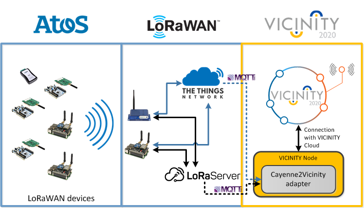

<!--
# Copyright (C) 2018 ATOS Spain S.A., Sky-Watch
# All rights reserved. This program and the accompanying materials
# are made available under the terms of the Eclipse Public License 2.0
# which accompanies this distribution, and is available at
# https://www.eclipse.org/legal/epl-2.0/
# 
# SPDX-License-Identifier: EPL-2.0
#
# Contributors:
#     ATOS Spain - agile-lora protocol implementation
#	  SKy-Watch - LoRaServer Dockerization and integration
-->

# MQTT/Cayenne LPP Adapter (LoRaWAN)

> Adapter that translates between [Cayenne Low Payload Protocol (LPP)](https://mydevices.com/cayenne/docs/lora/) and the VICINITY Agent. Moreover, it also embraces the gathering of data from well-known LoRaWAN stacks (i.e. [The Thing Network -TTN](https://www.thethingsnetwork.org/) and [LoRaServer](https://www.loraserver.io/))


## Architecture

This adapter brings an end-to-end communication with LoRaWAN (Class A) nodes. Digging a little bit into the details, sudo the adapter subscribers to either TTN/LoRaServer's MQTT Brokers and manages the exchange of information with the AGILE agent.

|  | 
|:--:|
| *Cayenne adapter architecture (TBD)* |


## Configuration

Basically, we need to specify the following (environment) variables, which define: 1- VICINITY node information, 2- the connection to the TTN/LoRaServer MQTT Broker. The way to declare them is to include them in a file called `.env`, and put it at the root path. Internally, the system will properly load and handle these environment variables.

```
VICINITY_AGENT_ID="AGENT_ID"  
VICINITY_AGENT_PASSWORD="Password"
VICINITY_GATEWAY_API_ID="username"
VICINITY_GATEWAY_API_PASSWORD="pwd"
LORAWAN_APP_SERVER = "LoRaServer"  # Current options handled ("TTN", "LoRaServer")
LORAWAN_APPID  = "<YOUR APP ID>"
LORAWAN_PSW    = "<YOUR APP password>"
LORAWAN_URL = "< URL to the MQTT Broker>"
LORAWAN_MQTT_PORT=1883  # Port where MQTT is listening (by default, 1883)
```
As hinted above, concerning the LoRaWAN realm, two options are available (*TTN* or *LoRaServer*), with slight differences between each other. For a deeper understanding, please refer to [TTN](https://www.thethingsnetwork.org/docs/applications/mqtt/) and [LoRaServer](https://www.loraserver.io/install/mqtt-auth/) MQTT documentation. 


## Launching the adapter

  ### 1. Python scripts

The development of this Adapter has been done with *Python* (namely, Python 3). Hence, making it work is pretty straightforward (in any OS). Obviously, the first step is to have **Python** (and its more well-known package manager, **pip**) installed in the system. For instance, for Linux-based OSs, this command would make it:

```
sudo apt-get install python3 python3-dev python3-pip
```

Once the foundations are ready, it is time to install the adapter's dependencies; in this case, through an explicit requirements file available in the repository

```
sudo python3 -m pip install -r requirements.txt
```

And last, but not least, this is how the main script is executed

```
python3 ./cayenne_adapter.py
```

  ### 2. Docker (from source code)

Another way of running the code is via [Docker](https://www.docker.com/), a simple yet powerful way to "abstract" the execution of the code from the actual host OS. The way to build a Docker image from the source code is through the following command (obviously, Docker must be installed in the system - tutorial of how to do it [here](https://docs.docker.com/install/)).

```
docker build -t <image_name> .
```

Where `<image_name>` is a label that will identify the created Docker image.

Once the image is created, we can run a container based on this `<image_name>` with this command. NOTE: **Even though it is possible to introduce all the environment variables in the command below, it is much more comfortable to relying on the `.env` file described in the configuration section** 


```
docker run -p 9995:9995 --name=<container_name>   <image_name>
```

Where we specify that both host and container will be listening at port **9995** (this cannot be changed), `<container_name>` is again a label for identifying the running container, and `<image_name>` is the name of the image we had built before.

  ### 3. docker-compose (from source code)

As a third option, it is also possible to use docker-compose to automatically build and run a Docker image. The unique thing that is to be configured by users is, likewise the first two cases, to set the environment variables. Again, we can create our own `.env` file or, as shown below, we can also define them in a `docker-compose.yml` file (we have included as example a `docker-compose-sample.yml`, where users only have to update with their own variables)   
   
   ```
version: '3'
services:
    vicinity-cayenne-adapter:
      container_name: vicinity-cayenne-adapter
      # image: ioelab/vicinity-cayenne-adapter
      build: .    
      environment:
        - VICINITY_AGENT_ID="AGENT_ID"  # Development
        - VICINITY_AGENT_PASSWORD="AGENT_PASSWORD"
        - VICINITY_GATEWAY_API_ID="username"
        - VICINITY_GATEWAY_API_PASSWORD="pwd"
        - LORAWAN_APP_SERVER="LoRaServer" or "TTN"
        - LORAWAN_APPID="app_name"
        - LORAWAN_PSW="application_server_psswd"
        - LORAWAN_MQTT_URL="mqtt_broker_url"   
        - LORAWAN_MQTT_PORT=1883 
      ports: 
        - 9995:9995/tcp
      restart: always    
      network_mode: "host"
   ```  

The next and last step to make it run is the following command:
   
```
docker-compose up
```


## API

According to the [Adapter documentation](https://github.com/vicinityh2020/vicinity-agent/blob/master/docs/ADAPTER.md) and [template](https://github.com/vicinityh2020/vicinity-adapter-template), every adapter should expose the following endpoints

`GET /objects` - Returns the list of objects registered at the adapter

`GET /objects/{oid}/properties/{pid}` - Returns last known value and time the value was received by the device. “oid” is UUID of device and “pid” is a property identifier

`PUT /objects/{oid}/properties/{pid}` - Update an oid's property with a given value. Illustrative example below (to show the request body), 

```
curl -X PUT \
  <route-to-adapter>/objects/33393437713562140/properties/Temperature \
  -H 'Content-Type: application/json' \
  -d '{
"value": 12054
}'
```

Where we have to address the  `<route-to-adapter>` parameter to the actual location of our adapters (for instance, in the current configuration, it would be `http://localhost:9995/adapter/`)